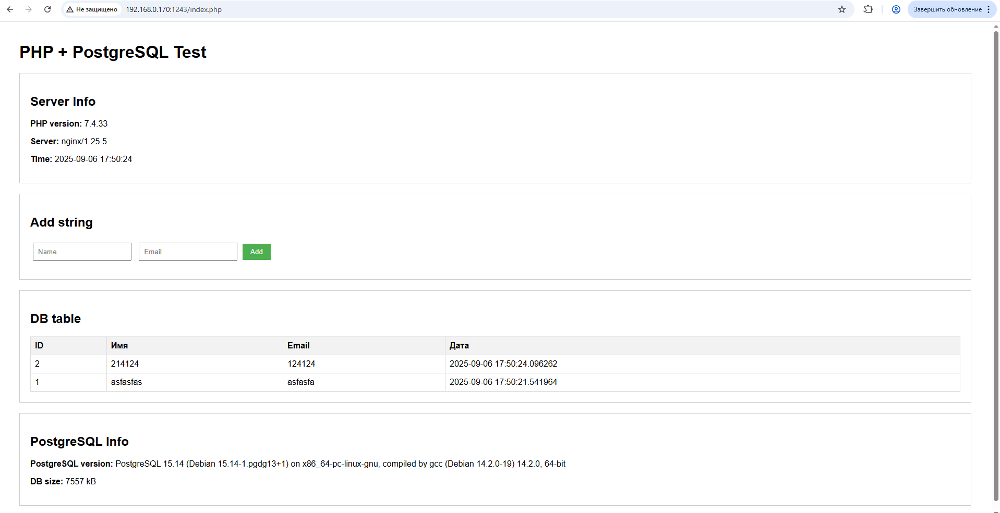

# Project: Deploy Automation

## 📋 System Requirements

### Minimum Specifications
- **Operating System**: CentOS/RHEL/Rocky Linux 9
- **Python Version**: 3.9+
- **Pre-installed Software (server)**: 
  - Docker 28.3.0, build 38b7060
  - python3 3.9.21
  - ansible core 2.15.13
  - git 2.47.1
- **Hardware Requirements**:
  - 2+ vCPU cores
  - 4+ GB RAM
  - 20+ GB storage

## Quick Start
#### Clone Project
```
git clone https://github.com/egorpivondepalo/vita-devops.git
cd vita-devops
```

#### Install Ansible Deps
```bash
ansible-galaxy collection install community.docker --force
```

#### Python Environment Setup
```bash
python -m venv venv
source venv/bin/activate
pip install -r requirements.txt
```


## Manual Run Playbook
- On local server
```bash
# INIT (prepare server)
ansible-playbook ansible/init.yml --tags init

# DRY-RUN (generate files and deps on server)
ansible-playbook ansible/deploy.yml --tags dry-run

# Release (deploy to dev)
ansible-playbook ansible/deploy.yml --tags dev

# Release (deploy to release)
ansible-playbook ansible/deploy.yml --tags release

# PRUNE (stop all containers, clean working_dir and remove volumes)
ansible-playbook ansible/deploy.yml --tags prune
```


## **Automatic Deploy**
### **On local server**
- Run script `run_playbook.py` with params
```bash
# run on local server
python3 run playbook.py --dev --local

# run on remote server
python3 run_playbook.py --dev --host "remote_host_ip" --key "path_to_private_ssh_key"
```

### **On remote server**
- Prepare
```bash
# generate ssh-key w/o encryption (~/.ssh/id_rsa - default) and copy it to remote server
ssh-keygen
ssh-copy-id root@$remote_server_address
```

- Run script for init environment
```bash
python3 run_playbook.py --host "192.168.0.170" --tag init --ssh-key "~/.ssh/id_rsa"
```

- Run script for deploy services
```bash
python3 run_playbook.py --host "192.168.0.170" --tag dev
```

**Arguments:**
    --tag - select tag:
              dev - deploy for development
              release - deploy for release
              dry-run - only build files and configs, Docker not required
              prune - stop containers, remove volumes and files

    --host - host for init and deploy:
              127.0.0.1 or local - local server, not required ssh-key
              XXX.XXX.XXX.XXX - address for remote server, required ssh-key on server
      
    -v - verbose, show cmd and logs

    --dry-run - dont execute cmd, only log in terminal
              
    --ssh-key - path to ssh key for remote server (default - ~/.ssh/id_rsa)
    --


## Results
**Deploy on remote host**
  - playbook for init server environment and prepare to deploy
  - playbook for deploy containers
  - template-generated docker-compose file, nginx configs and inventory
  - wait for up PSQL database, check connection in playbook
  - wait for php_fpm and nginx container
  - tested read/write to database
  - script to run playbook and generate summury

**Example generated files**  
You can find example generated files in **out/generated_configs**
This files cloned from remote server after RunPlaybook deploy script.



## Plans TODO
- **Create custom Ansible modules**
- **Generating reports from deploy**
- **Move configs to another repo, pull on deploy**
- **Move repository to GitLab**
- **Create pipeline automation**
- **Observability: health-check + prometheus + grafana**
- **KVM-virtualization**
- **Vault Secret Management**


## ⚠️ Known Issues & Resolutions

### 1. Firewall Port Access Issue
**Problem**: Connection refused on http://127.0.0.1:1243

**RESOLVED**: *ADDED TASK FOR ALLOW CUSTOM NGINX PORT!*

### 2. PHP-FPM Container Connection Drops
**Problem**: Container rejects incoming connections with error:
```
ERROR: Connection disallowed: IP address '172.18.0.X' has been dropped.
```

**Root Cause**: Misconfigured listen directive in PHP-FPM configuration

**Resolution**: Update PHP-FPM configuration in Dockerfile
```dockerfile
# Fix PHP-FPM configuration
RUN sed -i 's/^listen = .*/listen = 0.0.0.0:9000/' /usr/local/etc/php-fpm.d/www.conf && \
    sed -i 's/^;listen.allowed_clients/listen.allowed_clients = 0.0.0.0/' /usr/local/etc/php-fpm.d/www.conf
```

### 3. PHP-FPM Has No PSQL-drivers
**Problem**: PHP-FPM container can't connect to postgres database:
`PSLQ-driver not found`

**Resolution**: Update Dockerfile with php-fpm **(current solution)**:
```
FROM php:7.4-fpm

RUN sed -i 's/^listen = .*/listen = 0.0.0.0:9000/' /usr/local/etc/php-fpm.d/www.conf

RUN apt-get update && \
    apt-get install -y --no-install-recommends libpq-dev && \
    rm -rf /var/lib/apt/lists/*

RUN docker-php-ext-install pdo_pgsql pgsql
```

Or use container with pre-installed postgres drivers **(non-tested)**:
```
FROM bitnami/php-fpm:7.4

RUN sed -i 's/^listen = .*/listen = 0.0.0.0:9000/' /opt/bitnami/php/etc/php-fpm.conf
```
